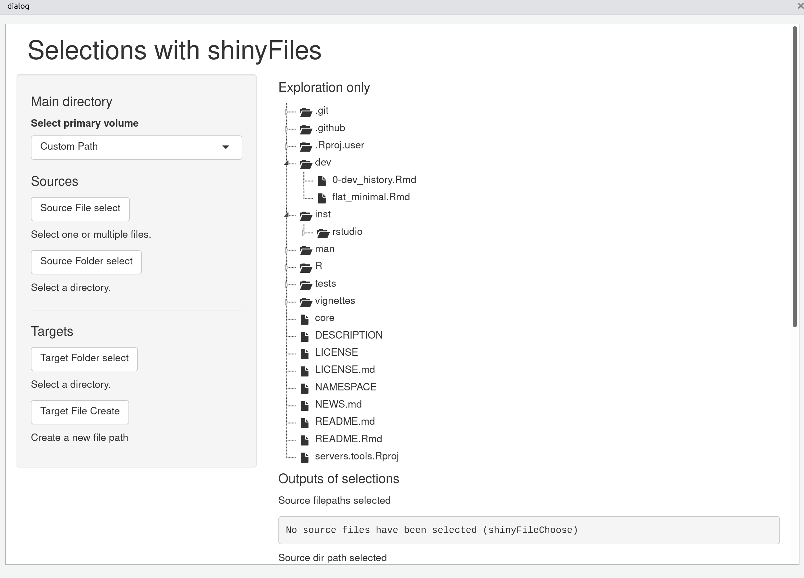

<!-- README.md is generated from README.Rmd. Please edit that file -->

# servers.tools

<!-- badges: start -->
<!-- badges: end -->

The goal of servers.tools is to …

## Installation

You can install the development version of servers.tools like so:

``` r
remotes::install_github("statnmap/servers.tools")
```

## Example

``` r
#' \dontrun{
library(shiny)
library(shinyFiles)
library(shinyTree)
# shinyFiles::shinyFilesExample()
file_explorer()

# Use with custom path
cat("test", file = tempfile("custom", fileext = ".R"))
file_explorer(path = tempdir())
#' }
```


